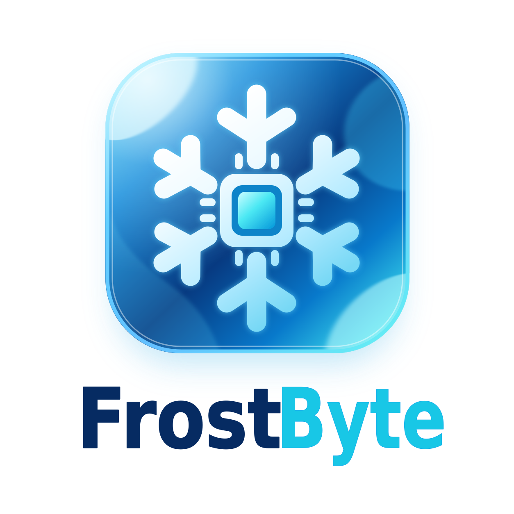
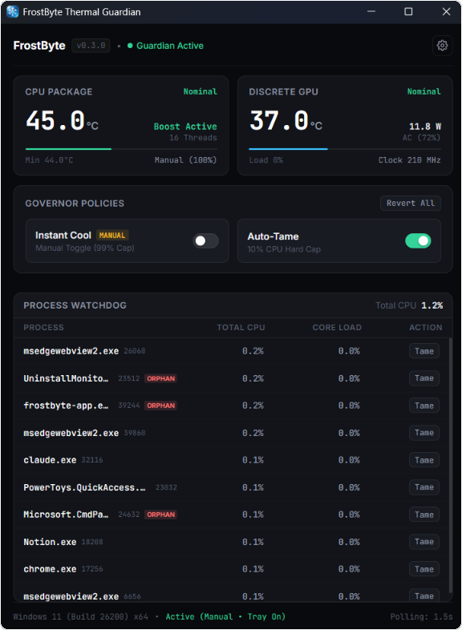
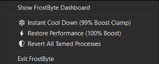

<p align="center">
  
</p>

<p align="center">
  A lightweight Windows thermal guardian and process watchdog.<br>
  Detects single-thread CPU runaway loops, clamps thermal spikes via power governor, and caps rogue background tasks without killing them.
</p>

<p align="center">
  <a href="https://github.com/orbz22/frostbyte/stargazers"></a>
  <a href="https://github.com/orbz22/frostbyte/releases/latest"></a>
  <a href="https://github.com/orbz22/frostbyte/releases/latest"></a>
  <a href="https://github.com/orbz22/frostbyte/actions/workflows/ci.yml"></a>
  <a href="LICENSE"></a>
  
</p>

<p align="center">
  
</p>

---

## Why FrostByte?

On modern multi-core processors, a background thread stuck in an infinite loop consumes 100% of a single logical core. On a 16-thread CPU, Windows Task Manager averages this out to just **~6% total CPU usage**, making the problem invisible at a glance.

However, the Windows scheduler interprets that saturated thread as maximum demand and engages **Turbo Boost**, running that core at peak clock frequency and high voltage. On laptops with compact cooling systems and shared heatpipes, this concentrated thermal load rapidly drives CPU package temperatures to **90°C–95°C+**, spinning fans to maximum RPM even when the machine is otherwise idle.

FrostByte monitors per-thread execution deltas directly and mitigates these conditions automatically:

1. **Per-Thread Core Saturation Heuristics:** Flags background processes saturating $\ge 80\%$ of a single logical core over consecutive evaluation windows.
2. **Non-Destructive Job Object Rate Limiting:** Throttles confirmed rogue processes to a hard 10% CPU quota via Win32 Job Objects, rather than terminating them and risking data loss.
3. **Automated Power Governor:** Clamps Windows processor state (`PROCTHROTTLEMAX` 99%) when thermals exceed safe thresholds, instantly disabling Turbo Boost and dropping CPU package temperatures by 15°C–25°C.

---

## Architecture & Implementation

FrostByte is written in pure Rust and split into three workspace crates:

```
crates/
├── frostbyte-core/   # Sensor queries, thread delta math, Job Object API, power governor
├── frostbyte-app/    # Tauri v2 desktop GUI and system tray shell
└── frostbyte-cli/    # Standalone terminal monitoring daemon
```

### Core Mechanisms

- **Thermal Telemetry (`frostbyte-core::thermal`):**
  Queries motherboard ACPI Thermal Zones (`\_TZ.THRM`) in-process using the native Windows Performance Data Helper (`pdh.dll`). Runs under standard non-elevated user privileges with sub-millisecond query latency and zero console window allocations. Discrete GPU metrics (temperature, power draw, core clock, and load) are queried via NVIDIA NVML / SMI.

- **Process & Thread Delta Sampler (`frostbyte-core::process`):**
  Uses `CreateToolhelp32Snapshot` to enumerate processes and active threads. Measures microsecond kernel and user time deltas via `GetProcessTimes` and `GetThreadTimes`, normalized against wall-clock time and available logical cores.

- **Soft-Taming Mitigation (`frostbyte-core::mitigation`):**
  Assigns target processes to an anonymous Windows Job Object configured with `JOBOBJECT_CPU_RATE_CONTROL_INFORMATION` (`JOB_OBJECT_CPU_RATE_CONTROL_HARD_CAP` set to 10% rate) and drops process priority to `IDLE_PRIORITY_CLASS`. Throttles can be reverted individually or globally on application exit.

- **Power Governor (`frostbyte-core::governor`):**
  Modifies active power schemes via `powercfg` (`/setacvalueindex SCHEME_CURRENT 54533251-82be-4824-96c1-47b60b740d00 bc5038f7-23e0-4960-96da-33abaf5935ec <99|100>`). Setting maximum processor frequency to 99% disables Intel Turbo Boost and AMD Precision Boost, bringing the processor to its base frequency.

---

## System Tray

<p align="center">
  
</p>

FrostByte runs as a native background tray process:

- **Instant Cool Flyout:** Toggle between 99% cap (Cool) and 100% boost (Normal) with live checkmarks (`✓`).
- **Auto-Tame Flyout:** Enable or disable automatic 10% CPU capping for rogue processes, or reset all active Job Objects.
- **Left-Click:** Toggles dashboard visibility.
- **Clean Exit:** Automatically releases all Job Object rate limits before terminating.

---

## Getting Started

### Requirements
- Windows 10 or Windows 11 (64-bit)
- Rust 1.75+ (MSVC toolchain: `x86_64-pc-windows-msvc`)

### Build & Run

```powershell
# Clone the repository
git clone https://github.com/orbz22/frostbyte.git
cd frostbyte

# Run the desktop application
cargo run -p frostbyte-app --release

# Or run the CLI monitor
cargo run -p frostbyte-cli -- --auto-tame
```

The compiled binary will be placed at `target/release/frostbyte-app.exe`.

---

## Configuration

Settings are stored in `%LOCALAPPDATA%\FrostByte\config.json`:

```json
{
  "auto_tame": true,
  "cool_mode": false,
  "auto_cool": true,
  "auto_cool_temp_threshold": 88.0,
  "saturation_threshold": 80.0,
  "autostart": true,
  "close_to_tray": true
}
```

| Key | Default | Description |
|---|---|---|
| `auto_cool` | `true` | Automatically clamp Turbo Boost when CPU temperature reaches the ceiling threshold. |
| `auto_cool_temp_threshold` | `88.0` | Temperature ceiling (°C) that triggers cooling clamping. |
| `auto_tame` | `true` | Automatically assign single-core runaway processes to a 10% CPU Job Object. |
| `saturation_threshold` | `80.0` | Per-thread CPU load percentage threshold required to trigger loop detection. |
| `autostart` | `false` | Launch minimized to system tray on Windows login (`HKCU\...\Run`). |
| `close_to_tray` | `true` | Minimizes window to tray on close ('X') instead of terminating. |

---

## Safety & Immunity Whitelist

To guarantee system stability, critical operating system processes, antivirus agents, and driver services are hardcoded as immune (`frostbyte-core::safety::whitelist`). They cannot be throttled or terminated:

```
system, smss.exe, csrss.exe, wininit.exe, services.exe, lsass.exe,
lsm.exe, winlogon.exe, dwm.exe, explorer.exe, sihost.exe, taskhostw.exe,
fontdrvhost.exe, audiodg.exe, svchost.exe, msmpeng.exe, nissrv.exe,
securityhealthservice.exe, smartscreen.exe, nvcontainer.exe,
nvdisplay.container.exe, amdfendrsr.exe, igfxcuiservice.exe,
rtkaudioservice64.exe, frostbyte.exe, frostbyte-app.exe
```

---

## Documentation

- [`docs/PRD.md`](docs/PRD.md) — Product requirements and problem analysis
- [`docs/DESIGN.md`](docs/DESIGN.md) — UI/UX design specifications and token architecture
- [`docs/ARCHITECTURE.md`](docs/ARCHITECTURE.md) — Subsystem architecture and IPC contracts
- [`docs/SAFETY_RULES.md`](docs/SAFETY_RULES.md) — Whitelisting rules and mitigation safety constraints
- [`docs/ROADMAP.md`](docs/ROADMAP.md) — Milestone tracking and future releases

---

## License

MIT License. See [`LICENSE`](LICENSE) for details.
